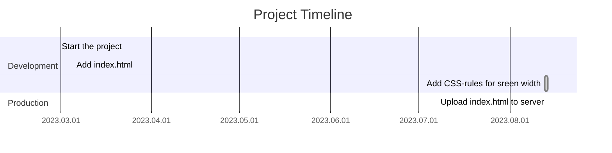
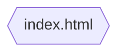

# tropin.one

Код моего сайта-визитки [tropin.one](https://tropin.one). Пока что на чистом HTML + CSS. Пишу его по мере изучения этих самых HTML и CSS.

<!-- vim-markdown-toc GFM -->

* [To-Do](#to-do)
* [График работы над сайтом](#График-работы-над-сайтом)
* [Sitemap](#sitemap)

<!-- vim-markdown-toc -->

## To-Do

- [ ] Сделать скроллинг для `<article>`
- [ ] Переместить оглавление страницы в правый сайдбар и сделать его видимым во время прокрутки `<article>`
- [x] Сделать адаптивную вёрстку

## График работы над сайтом

## Sitemap

