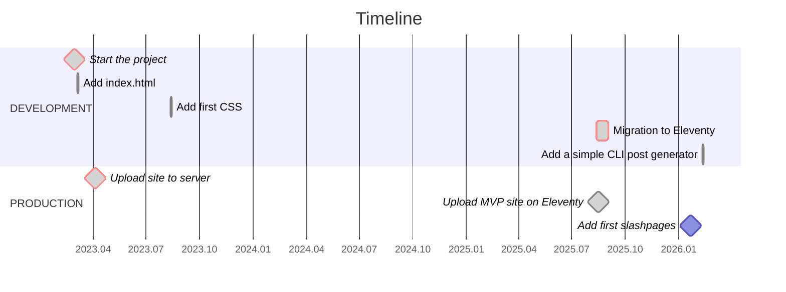

# tropin.one

[](https://wakatime.com/badge/github/tropintropin/tropin)


## About

This is my personal website where I share projects, experience, blog posts and some staff from my Digital Garden. In 2025, I migrated it to Eleventy to make building and updating faster and simpler.

## Project Timeline



## Tech Stack

- **Eleventy** – static site generator
- **Nunjucks** – templating engine
- **Leaflet** — map engine
- **SCSS → CSS** – styles preprocessor
- **JavaScript** – client-side interactivity
- **Pagefind** – search indexing for static sites
- **GitHub Actions** – CI/CD automation

## Deployment

- Automatically deployed via GitHub Actions to GitHub Pages
- Eleventy builds output to `_site` folder

## NPM Scripts Overview

- **new** – Create a new blog, event, project, or research post using a template and interactive prompts:

  ```bash
  npm run new
  ```

- **build:css** – Compile SCSS to CSS (compressed, no source maps):

  ```bash
  npm run build:css
  ```

- **watch:css** – Watch SCSS files for changes and recompile automatically:

  ```bash
  npm run watch:css
  ```

- **start** – Start Eleventy dev server with live reload:

  ```bash
  npm run start
  ```

- **pagefind** – Build Pagefind search index from `_site`:

  ```bash
  npm run pagefind
  ```

- **watch:pagefind** – Watch HTML files in \_site and rebuild search index on changes:

  ```bash
  npm run watch:pagefind
  ```

- **dev** – Development mode: watch SCSS, run Eleventy server, and auto-rebuild search index:

  ```bash
  npm run dev
  ```

  _Note_: On the first run, `_site` is empty. Run `npm run pagefind` once before starting `dev` for search to work or just repeat `npm run dev` again (useful on WSL).

- **build** – Full production build: CSS + Eleventy + Pagefind:

  ```bash
  npm run build
  ```

- **clean** – Remove the `_site` folder:

  ```bash
  npm run clean
  ```

## Project Structure

```
.
├── scripts/             # Utility scripts (e.g., webmentions)
├── src/                 # Source files
│   ├── _data/           # Global site data (JSON)
│   ├── _includes/       # Layouts and Nunjucks partials
│   │   ├── layouts/     # Page-level templates
│   │   └── partials/    # Reusable UI components
│   ├── _templates/      # Markdown & Nunjucks templates for new content
│   ├── assets/          # Static assets
│   │   ├── css/         # Compiled CSS
│   │   ├── js/          # Client-side scripts
│   │   ├── scss/        # Source styles (SCSS)
│   │   └── images/      # Content images (blog, events, etc.)
│   ├── blog/            # Blog posts
│   ├── events/          # Events data
│   ├── projects/        # Project showcase
│   ├── research/        # Academic and research papers
│   ├── root/            # Root-level files (CNAME, robots.txt, manifest)
│   └── *.njk            # Top-level pages (index, setup, playbook, etc.)
├── .eleventy.js         # Eleventy configuration
├── package.json         # Dependencies and scripts
└── README.md
```
