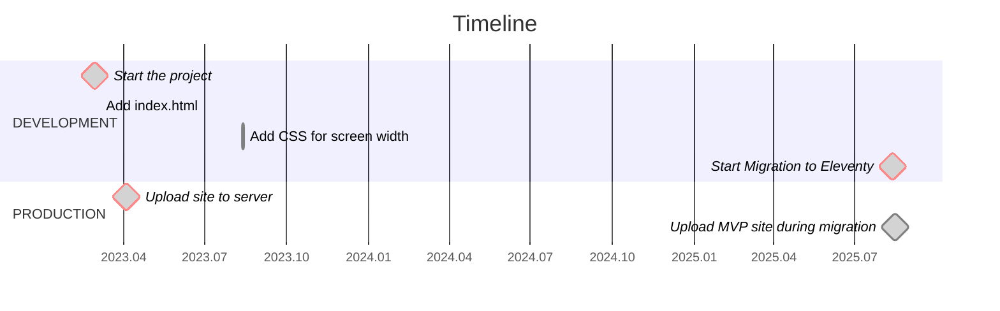

# tropin.one

[](https://wakatime.com/badge/github/tropintropin/tropin)


## About
This is my personal website where I share projects, experience, and blog posts. In 2025, I migrated it to Eleventy to make building and updating faster and simpler.

## Project Timeline



## Tech Stack
- Eleventy (static site generator)
- Nunjucks templates
- CSS, JS
- Pagefind for search
- GitHub Actions for CI/CD

## Deployment
- Automatically deployed via GitHub Actions to GitHub Pages
- Eleventy builds output to `_site` folder


## Project Structure

```
.
├── .eleventy.js         # Eleventy configuration
├── .github/workflows    # CI/CD scripts (deployment)
├── package.json         # Project dependencies and scripts
├── README.md            # Documentation
└── src
    ├── _data            # Site data (JSON, JS)
    ├── _includes        # Templates and partial Nunjucks components
    ├── assets           # Styles (CSS), scripts (JS), and images
    ├── root             # Files for site root (CNAME, robots.txt, etc.)
    └── index.njk        # Main page
```
