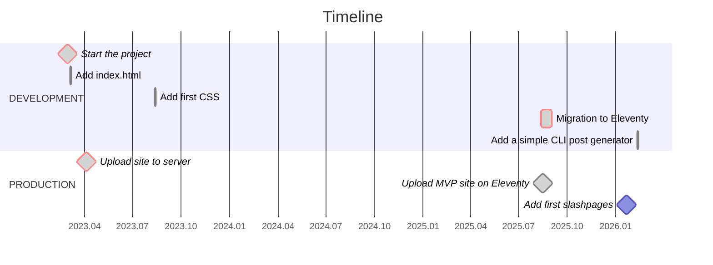

# tropin.one

[](https://wakatime.com/badge/github/tropintropin/tropin)


## About

This is my personal website where I share projects, experience, blog posts, and entries from my Digital Garden, including _IndieWeb_-inspired slashpages. In 2025, I migrated it to _Eleventy_ to make building and updating faster and simpler.

## Tech Stack

- **Eleventy** – static site generator
- **Nunjucks** – templating engine
- **Leaflet** — map engine
- **Thunderforest** — map tiles provider
- **SCSS → CSS** – styles preprocessor
- **JavaScript** – client-side interactivity
- **Pagefind** – search indexing for static sites
- **GitHub Actions** – CI/CD automation

## Requirements

- Node.js 22+
- `npm`
- Unix-like environment (macOS, Linux, or WSL)

## NPM Scripts

### Core Workflow

These are the commands used in normal development and deployment.

- **`new`** – Create a new blog, event, project, or research entry using an interactive CLI generator:

  ```bash
  npm run new
  ```

  Used during content creation.

- **`dev`** – Run the full development environment:
  - Watch and compile SCSS
  - Start Eleventy dev server with live reload
  - Watch generated HTML and rebuild the Pagefind index

  ```bash
  npm run dev
  ```

  This is the main command used during development.

  **Note**: On a completely clean project (empty `_site`), Pagefind may require one initial build before search works properly.

- **`clean`** – Remove the generated `_site` directory:

  ```bash
  npm run clean
  ```

  Useful before a fresh production build or when troubleshooting.

- **`build`** – Run the full production build pipeline:
  - Compile CSS
  - Build Eleventy site
  - Generate the Pagefind search index
  - Send webmentions

  ```bash
  npm run build
  ```

  This command is used in CI and GitHub Actions during deployment.

### Low-Level / Helper Scripts

These are individual steps used internally by `dev` or `build`.

- **`build:css`** – Compile SCSS to compressed CSS (no source maps):

  ```bash
  npm run build:css
  ```

- **`watch:css`** – Watch SCSS files and recompile automatically:

  ```bash
  npm run watch:css
  ```

- **`start`** – Run Eleventy dev server only (no CSS watcher, no Pagefind watcher):

  ```bash
  npm run start
  ```

- **`pagefind`** – Generate the Pagefind search index from the `_site` directory:

  ```bash
  npm run pagefind
  ```

- **`watch:pagefind`** – Watch HTML files inside `_site` and rebuild search index on changes:

  ```bash
  npm run watch:pagefind
  ```

- **`send-webmentions`** — Send outgoing webmentions after a production build:

  ```bash
  npm run send-webmentions
  ```

  This script is integrated into the production build pipeline and executed automatically during CI/CD.

## Project Structure

```
.
├── scripts/             # Utility scripts (e.g., webmentions)
├── src/                 # Source files
│   ├── _data/           # Global site data (JSON)
│   ├── _includes/       # Layouts and Nunjucks partials
│   │   ├── layouts/     # Page-level templates
│   │   └── partials/    # Reusable UI components
│   ├── _templates/      # Markdown & Nunjucks templates for new content
│   ├── assets/          # Static assets
│   │   ├── css/         # Compiled CSS
│   │   ├── js/          # Client-side scripts
│   │   ├── scss/        # Source styles (SCSS)
│   │   └── images/      # Content images (blog, events, etc.)
│   ├── blog/            # Blog posts
│   ├── events/          # Events data
│   ├── projects/        # Project showcase
│   ├── research/        # Academic and research papers
│   ├── root/            # Root-level files (CNAME, robots.txt, manifest)
│   └── *.njk            # Top-level pages (index, setup, playbook, etc.)
├── .eleventy.js         # Eleventy configuration
├── package.json         # Dependencies and scripts
└── README.md
```

## Deployment

- Automatically deployed to _GitHub Pages_ via _GitHub Actions_ on every push to `main`

- Production build runs `npm run build`

- Eleventy outputs generated files to `_site`

## Project Timeline


